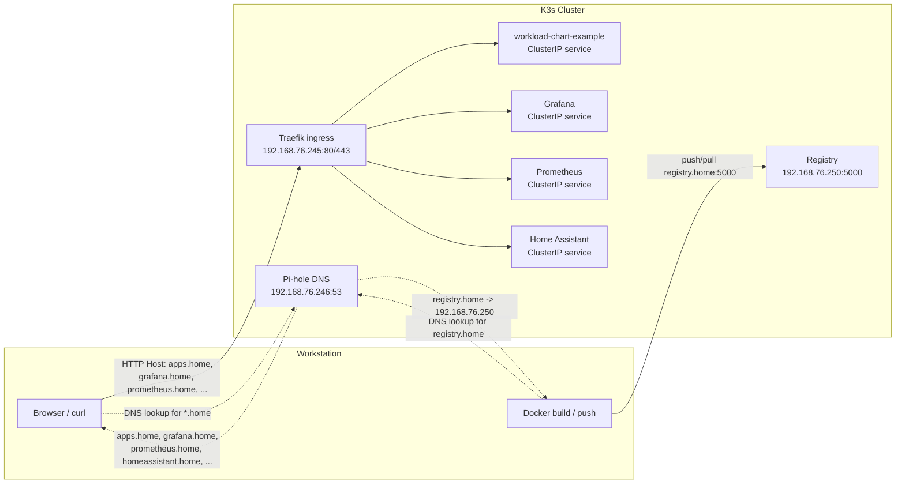

# Homelab


Personal Kubernetes homelab running on [K3s](https://k3s.io/), fully declared in Git and deployed with [Helmfile](https://github.com/helmfile/helmfile).

## Quick Start

**Prerequisites:** Linux system with `kubectl`, `helm`, and `helmfile` installed.

```bash
# Bring up the cluster
make up

# Re-sync after config changes
make sync

# Run local validation
make validate-fast
make validate

# Tear down the cluster
make down
```

`make up` installs K3s, deploys the Helmfile releases, builds local app images, and points this workstation at the in-cluster Pi-hole DNS once it is ready. Browser-facing services use `.home` hostnames, which Pi-hole resolves to Traefik so requests can be routed to the right in-cluster service.

To toggle homelab DNS manually on this machine:

```bash
make pihole-dns-enable
make pihole-dns-disable
make pihole-dns-status
```

### Default Access

| Service        | Access                                          | Credentials                                                     |
| -------------- | ----------------------------------------------- | --------------------------------------------------------------- |
| Grafana        | [grafana.home](http://grafana.home)             | admin / admin                                                   |
| Prometheus     | [prometheus.home](http://prometheus.home)       | —                                                               |
| Home Assistant | [homeassistant.home](http://homeassistant.home) | Setup on first visit                                            |
| Headlamp       | [headlamp.home](http://headlamp.home)           | `kubectl create token headlamp -n kube-system --duration=8760h` |
| Authentik      | [authentik.home](http://authentik.home)         | Setup on first visit                                            |
| Longhorn UI    | [longhorn.home](http://longhorn.home)           | —                                                               |
| Pi-hole        | [pihole.home/admin/](http://pihole.home/admin/) | admin / `pihole`                                                |
| Apps           | [apps.home](http://apps.home)                   | —                                                               |
| PostgreSQL     | `192.168.76.243:5432` / in-cluster service      | SOPS-managed postgres credentials                               |

## Services

### Deployed by Helmfile

| Service                                                | Description                                                    |
| ------------------------------------------------------ | -------------------------------------------------------------- |
| [MetalLB](services/metallb/)                           | Manages static LAN IPs for Kubernetes services                 |
| [Traefik](services/traefik/)                           | Ingress controller for browser-facing services                 |
| [Longhorn](services/longhorn/)                         | Persistent storage for Kubernetes workloads                    |
| [Prometheus](services/prometheus/)                     | Collects CPU, memory, and other metrics from Kubernetes        |
| [Grafana](services/prometheus/)                        | Dashboards for metrics and logs, bundled with Prometheus chart |
| [Loki](services/loki/)                                 | Aggregates and stores logs from Kubernetes workloads           |
| [Promtail](services/promtail/)                         | DaemonSet that ships pod logs to Loki                          |
| [PostgreSQL](services/postgres/)                       | Shared database for homelab-owned applications                 |
| [Registry](services/registry/)                         | Local registry for Docker images built from `apps/`            |
| [Home Assistant](services/home-assistant/)             | Home automation platform                                       |
| [Mosquitto](services/mosquitto/)                       | MQTT broker for smart-home integrations                        |
| [Pi-hole](services/pihole/)                            | DNS and `.home` records                                        |
| [Headlamp](services/headlamp/)                         | Kubernetes dashboard; optional if `kubectl` is enough          |
| [Authentik](services/authentik/)                       | SSO / OIDC identity provider (WIP)                             |
| [API](apps/api/)                                       | REST API app for custom workloads                              |
| [Django](apps/django/)                                 | Database migration tool and admin interface                    |
| [Runner](apps/runner/)                                 | Internal UI for running approved app-owned jobs                |
| [Workload Chart Example](apps/workload-chart-example/) | Deployed reference app using the workload chart                |

### Prepared but Disabled

| Service                                                        | Description                                                           |
| -------------------------------------------------------------- | --------------------------------------------------------------------- |
| [Zigbee2MQTT](services/zigbee2mqtt/)                           | Zigbee coordinator bridge; enable after a Zigbee USB stick is present |
| [OpenThread Border Router](services/openthread-border-router/) | Thread border router; enable after a Thread RCP stick is present      |

## Network Flow

Example request flow. Most browser-facing services resolve through Pi-hole and route through Traefik, while a few direct endpoints like the local registry still bypass Traefik.

- Pi-hole handles all DNS for the `.home` domain, resolving to cluster services or forwarding to upstream DNS as needed.
- Traefik routes incoming HTTP requests by hostname to the appropriate ClusterIP services.



## Secrets

Sensitive Helm values live in encrypted `secrets.sops.yaml` files next to each service's `values.yaml`.

When Helmfile syncs, it decrypts and merges any `secrets.sops.yaml` files it finds into the release values. This keeps secrets out of plaintext Git history while still allowing them to be managed alongside regular config.

To create or edit a sops secrets file, run:

```bash
sops services/<service>/secrets.sops.yaml
```

To view decrypted contents:

```bash
sops -d services/<service>/secrets.sops.yaml
```

Add new secret files to the release's `secrets:` list in `helmfile.yaml` so Helmfile decrypts and merges them during `helmfile sync`.

## Authentik SSO

Authentik is exposed at [authentik.home](http://authentik.home) and uses the shared Postgres release for durable state. On first boot, finish the Authentik initial setup in the UI and create an API token.

If `TF_VAR_authentik_token` is set, `make up` applies the Terraform configuration after the infra Helmfile sync. That creates the Grafana OAuth client in Authentik, stores the generated client credentials in the `grafana-oauth-secret` Kubernetes Secret, and restarts Grafana so it can offer Authentik login.

For an existing cluster, run:

```bash
export TF_VAR_authentik_token='<token>'
make authentik-apply
```

## Project Layout

```
homelab/
├── helmfile.yaml                 # All releases, versions, and repos in one file
├── Makefile                      # Cluster lifecycle (up / down / sync)
├── charts/                       # Reusable local Helm charts shared across apps
│   └── workload/                 # Golden path chart for custom `apps/` workloads
├── scripts/
│   ├── setup.sh                  # Namespace creation and post-install bootstrap
│   └── ...
├── terraform/                    # Authentik OAuth2 provider config (WIP)
├── services/                     # Deployed and prepared third-party service config
│   ├── prometheus/               # Each service gets values.yaml and optional sops secrets
│   └── ...
├── apps/                         # Custom, in-house workloads deployed to the cluster
│   ├── api/
│   ├── workload-chart-example/
│   └── ...
└── notes/                        # Reference notes
```
