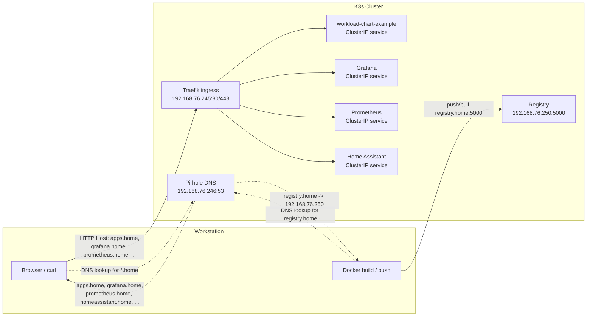

# Homelab


Personal Kubernetes homelab running on [K3s](https://k3s.io/), fully declared in Git and deployed with [Helmfile](https://github.com/helmfile/helmfile).

## Quick Start

**Prerequisites:** Linux system with `curl`, `kubectl`, `helm`, and `helmfile` installed.

```bash
# Bring up the cluster (installs K3s, deploys infra, builds local app images, deploys local apps)
make up

# Re-sync after config changes
make sync

# Run the fast local checks used by the pre-commit hook
make validate-fast

# Run the full local validation pass that mirrors CI
make validate

# Tear down everything (services, PVs, and K3s)
make down
```

`make up` bootstraps persistent local host mappings for the pinned homelab endpoints:

- `registry.home` -> `192.168.76.250`
- `apps.home` -> `192.168.76.245`

Those `/etc/hosts` entries stay in place across repeated `make down` / `make up` cycles. The IPs stay stable because both the registry and Traefik are pinned inside the MetalLB pool.

`make up` also flips this workstation to the in-cluster Pi-hole automatically after Pi-hole is healthy, and `make down` flips it back to normal DHCP-provided DNS before teardown.

If you need to toggle that behavior manually on this machine, use:

```bash
make pihole-dns-enable
make pihole-dns-disable
make pihole-dns-status
```

That points this machine's active NetworkManager connection at the cluster Pi-hole DNS service without changing the rest of the LAN. This enables all services to be accessible by their `.home` hostnames without additional configuration on this machine.

## Network Flow

Example request flow. Most browser-facing services resolve through Pi-hole and route through Traefik, while a few direct endpoints like the local registry still bypass Traefik.

- Pi-hole handles all DNS for the `.home` domain, resolving to cluster services or forwarding to upstream DNS as needed.
- Traefik routes incoming HTTP requests by hostname to the appropriate ClusterIP services.



### Default Access

| Service        | Access                                          | Credentials                                                     |
| -------------- | ----------------------------------------------- | --------------------------------------------------------------- |
| Grafana        | [grafana.home](http://grafana.home)             | admin / admin                                                   |
| Prometheus     | [prometheus.home](http://prometheus.home)       | —                                                               |
| Home Assistant | [homeassistant.home](http://homeassistant.home) | Setup on first visit                                            |
| Headlamp       | [headlamp.home](http://headlamp.home)           | `kubectl create token headlamp -n kube-system --duration=8760h` |
| Longhorn UI    | [longhorn.home](http://longhorn.home)           | —                                                               |
| Pi-hole        | [pihole.home/admin/](http://pihole.home/admin/) | admin / `pihole`                                                |
| Apps           | [apps.home](http://apps.home)                   | —                                                               |
| Frigate        | Not deployed by default                         | —                                                               |
| PostgreSQL     | [localhost:5432](postgresql://localhost:5432)   | postgres / postgres                                             |

## Services

| Service                                                | Description                                                     |
| ------------------------------------------------------ | --------------------------------------------------------------- |
| [MetalLB](services/metallb/)                           | Bare-metal load balancer — assigns LAN IPs via L2/ARP           |
| [Traefik](services/traefik/)                           | Ingress controller — routes traffic by hostname                 |
| [Longhorn](services/longhorn/)                         | Distributed block storage — default StorageClass for all PVCs   |
| [Prometheus](services/prometheus/)                     | Metrics collection from pods, nodes, and Kubernetes internals   |
| [Grafana](services/prometheus/)                        | Dashboards for metrics and logs — bundled with Prometheus chart |
| [Loki](services/loki/)                                 | Log aggregation with 7-day retention                            |
| [Promtail](services/promtail/)                         | DaemonSet that ships pod logs to Loki                           |
| [PostgreSQL](services/postgres/)                       | Postgres 17 with bootstrap SQL for initial database setup       |
| [Registry](services/registry/)                         | Local OCI registry for homelab-owned application images         |
| [Workload Chart Example](apps/workload-chart-example/) | Minimal example Go app using the workload chart                 |
| [Home Assistant](services/home-assistant/)             | Home automation platform with Prometheus metrics                |
| [Frigate](services/frigate/)                           | NVR with ML object detection — monitors 4 cameras via RTSP      |
| [Mosquitto](services/mosquito/)                        | MQTT broker connecting Frigate events to Home Assistant         |
| [Pi-hole](services/pihole/)                            | DNS-level ad blocker with custom local DNS entries              |
| [Headlamp](services/headlamp/)                         | Kubernetes web dashboard                                        |
| [Authentik](services/authentik/)                       | SSO / OIDC identity provider (WIP)                              |

## Project Layout

```
homelab/
├── helmfile.yaml                 # All releases, versions, and repos in one file
├── Makefile                      # Cluster lifecycle (up / down / sync)
├── charts/                       # Reusable local Helm charts shared across apps
│   └── workload/                 # Base single-workload application chart
├── scripts/
│   ├── setup.sh                  # Namespace creation and post-install bootstrap
│   └── update-charts.sh          # Detects available Helm chart updates
├── terraform/                    # Authentik OAuth2 provider config (WIP)
├── services/                     # Infra and third-party service values/config
│   ├── prometheus/               # Each deployed service gets its own directory
│   └── ...                       #
├── apps/                         # App-owned code, Dockerfiles, and workload values
│   ├── workload-chart-example/
│   └── ...
└── notes/                        # Hardware planning, Talos setup, scratch notes
```

## App-Owned Services

For applications you build and run yourself, the intended golden path is:

```text
apps/
└── lotus-api/
    ├── Dockerfile
    ├── <source files>
    └── values.yaml
```

The directory name becomes the image name and Helm release name. Build and push with:

```bash
make image-build SERVICE=lotus-api TAG=dev
make image-push SERVICE=lotus-api TAG=dev
# or in one step
make image-build-push SERVICE=lotus-api TAG=dev
```

By default this targets `registry.home:5000/homelab/<service>:<tag>`. You can print the resolved image name with:

```bash
make image-ref SERVICE=lotus-api TAG=dev
```

## Roadmap

- **Multi-node HA** — Expand to 3 nodes with Longhorn replication and pod anti-affinity
- **Authentik SSO** — OIDC integration across Grafana, Headlamp, and other services
- **Backups** — Velero for cluster resource and PV snapshots
