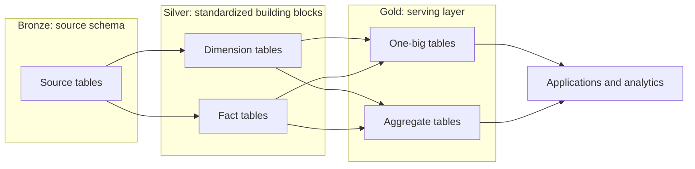

# dbt Transformations

This project manages Postgres transformations for the homelab data platform. It uses Python 3.13, uv, `dbt-core`, and `dbt-postgres`, and is designed to be orchestrated by Dagster.

## Architecture



- **Bronze:** Ingestion pipelines own raw landing tables in the existing `source` schema. dbt declares these tables under `models/source/` and treats them as immutable inputs. All bronze tables are declared in a single source properties file.
- **Silver:** dbt standardizes column names and data types, creates deterministic identifiers, deduplicates records, and builds reusable facts and dimensions in the `silver` schema.
- **Gold:** dbt joins and aggregates silver models into consumer-ready one-big tables and aggregate tables in the `gold` schema.

## Project Structure

```text
apps/dbt/
|-- macros/              # reusable Jinja and SQL helpers
|-- models/
|   |-- source/          # bronze source declarations, freshness, and tests
|   |-- silver/          # standardized facts and dimensions
|   `-- gold/            # consumer-ready OBT and aggregate tables
|-- dbt_project.yml      # project paths, schemas, and materializations
|-- packages.yml         # dbt package dependencies
|-- profiles.yml         # environment-driven Postgres connection
|-- pyproject.toml       # Python and dbt dependencies
`-- uv.lock              # reproducible Python dependency lock
```

## Local Development

From `apps/dbt`, install the locked Python and dbt dependencies:

```bash
uv sync --locked
uv run dbt deps
```

The profile reads its Postgres connection from the following environment variables:

```bash
export DB_HOST=localhost
export DB_PORT=5432
export DB_USER=postgres
export DB_PASSWORD=postgres
export DB_NAME=postgres
```

Build all models and run their data tests:

```bash
uv run dbt build --profiles-dir .
```

Run bronze source freshness checks separately:

```bash
uv run dbt source freshness --profiles-dir .
```

CI restores the Django-owned source contract from `apps/django/schema/source.sql`, loads the synthetic rows in `fixtures/bronze.sql`, then runs freshness checks and the full dbt build against Postgres 17. Fixtures stay local to this project because they describe transformation behavior rather than ingestion behavior.

Generate and serve the dbt documentation site:

```bash
uv run dbt docs generate --profiles-dir .
uv run dbt docs serve --profiles-dir .
```

## Modeling Standards

Every model must declare its grain with a uniqueness test and include not-null tests for the columns required at that grain. Facts and dimensions should also test their relationships and constrained values where applicable.

Gold models must include business-level data quality checks that validate the consumer-facing contract, such as required values and compound uniqueness.

Bronze source tables must define their own freshness checks when they have a reliable load timestamp and an expected ingestion cadence. Freshness thresholds should allow for the normal schedule plus a reasonable delay.

All current silver and gold models use table materialization. Incremental materialization may be worthwhile as the data volume grows, but it has not been introduced yet.

## Orchestration

Dagster will invoke this project through `dagster-dbt` after upstream ingestion assets complete. The integration should expose dbt models as downstream Dagster assets and run model builds, tests, and source freshness checks as appropriate for each pipeline.
