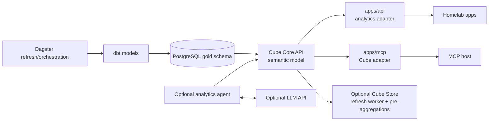

# Cube Semantic Layer

## Status

Research and implementation plan, not implemented. Survey completed 2026-08-31.

## Goal

Evaluate and eventually deploy Cube Core as a self-hosted semantic layer over the homelab's dbt-built PostgreSQL models. Cube should provide governed metrics, dimensions, definitions, joins, and bounded read-only queries to the existing API and MCP services without giving those consumers arbitrary SQL or broad database credentials.

Natural-language analytics and a hosted LLM are optional follow-on capabilities. The first useful milestone is a working, authenticated semantic API and MCP surface that does not require an LLM API key.

## Assumptions

- The initial deployment target is Cube Core in the K3s homelab, not Cube Cloud.
- PostgreSQL remains the source database, dbt remains responsible for transformations, and Dagster should own the production dbt build and orchestration.
- Cube should be deployed as an app-owned workload under `apps/cube/`. The implementation should provide its own Dockerfile and deployment convention rather than depending on a dedicated third-party Cube Helm chart; shared database privileges and infrastructure remain under `services/postgres/`.
- The first model should use the consumer-facing `gold.events_obt` relation rather than exposing bronze, silver, or personal application tables.
- The current homelab is small enough to begin with one internal Cube API instance and measured, bounded queries; high availability and pre-aggregations can be added only when demand justifies them.

## Current behavior

The repository already has the data and application boundaries needed for a semantic layer:

- [`apps/dbt`](../../apps/dbt/) models a PostgreSQL data platform with bronze/source declarations, standardized silver facts and dimensions, and gold consumer-facing tables. `dbt_project.yml` materializes silver and gold models as tables, and the `generate_schema_name` macro preserves the configured `silver` and `gold` schemas.
- [`apps/dbt/models/gold/events_obt.sql`](../../apps/dbt/models/gold/events_obt.sql) is the current serving model. It produces one row per event with identifiers, source/category/league, title, start time, status, JSON metadata, source modification time, and dbt generation time.
- [`apps/dagster`](../../apps/dagster/) has partial Dagster dbt resource wiring, but as of August 2026 the integration is not implemented: the current Dockerfile does not copy a dbt project into the image and no dbt asset or job is currently registered. Dagster should own the production dbt build, but the production refresh path for `gold.events_obt` still needs to be implemented before Cube relies on it.
- The shared [`services/postgres`](../../services/postgres/) chart runs PostgreSQL 17 and hosts application/source data plus separate Authentik and Dagster databases. It does not yet provision a dedicated read-only Cube role or a dedicated pre-aggregation schema.
- [`apps/api`](../../apps/api/) is a FastAPI service with direct SQLAlchemy access to the application database. It already exposes agenda, reminders, and events endpoints, but it has no Cube client or analytical query boundary.
- [`apps/mcp`](../../apps/mcp/) is an existing read-only Streamable HTTP MCP server. It calls the API through typed adapters and has production configuration for an inbound bearer token, a downstream API key, host/origin restrictions, health checks, structured logging, metrics, and tests. It does not yet call Cube.
- [`Tiltfile`](../../Tiltfile) and Helmfile already know how to build and deploy Python app workloads, but there is no Cube release, Cube model directory, Cube Store workload, or dbt development loop.

## Desired behavior

The data path should become:

The key boundaries are:

- dbt owns physical transformation logic, model grain, tests, and freshness contracts.
- Cube owns business-facing measures, dimensions, joins, segments, visibility, access policies, AI context, and query-facing APIs.
- API and MCP adapters own product-specific endpoint/tool contracts and caller authentication, but never connect downstream consumers directly to `gold` or `source` tables for analytics.
- An LLM, if introduced, selects from typed tools or generates a structured Cube query. It never receives PostgreSQL credentials or executes arbitrary SQL.

## Cube research findings

### Cube Core versus Cube Cloud

Cube Core is the open-source, headless semantic layer that can be self-hosted with Docker. It exposes Core Data APIs such as REST (JSON), GraphQL, Meta, and an optional Postgres-compatible SQL API. Cube Cloud is the commercial product layered on top of Cube Core with managed deployment, built-in analytics experiences, agentic chat, hosted MCP, and additional administration features.

The hosted Cube MCP server and Chat API documented by Cube are Cube Cloud features on paid plans. They should not be assumed to exist in a self-hosted Cube Core deployment. For this repository, the practical self-hosted pattern is the same one used by the POC: keep the current homelab MCP service and add a thin Cube adapter that calls Cube's authenticated Meta and REST APIs.

### Data modeling

Cube cubes map to source tables or queries and define measures, dimensions, joins, segments, and pre-aggregations. Cube views provide the curated public facade for downstream consumers. A recommended model for this repository is an internal `events` cube over `gold.events_obt` plus a focused public view such as `events_overview`.

The initial model should expose only fields that are useful and safe for analytics:

| Cube member                    | Initial meaning                                                   |
| ------------------------------ | ----------------------------------------------------------------- |
| `event_count`                  | Count of event IDs at the selected grain                          |
| `id`                           | Stable event identifier, subject to a decision about exposing IDs |
| `source`, `category`, `league` | Event classification dimensions                                   |
| `title`                        | Event title dimension                                             |
| `start_at`                     | Time dimension for upcoming and historical event analysis         |
| `status`                       | Scheduled, in-progress, completed, postponed, or cancelled        |

The JSON `metadata` column and high-cardinality identifiers should not be automatically exposed in the first public view. Participant-level analytics can be modeled later if the JSON shape is promoted into a relational gold model.

Descriptions should be required for every public member. Cube also supports `meta.ai_context` on views and members for agent-specific guidance, such as preferred measures, timestamp semantics, synonyms, and known data-quality limitations.

### dbt integration

Cube's self-hosted `cube_dbt` package can load a dbt `manifest.json`, filter models by path, tag, or name, and render dbt models as Cube cubes and dimensions. Cube Cloud also has a separate dbt pull integration that parses a repository and generates Cube files, but that feature is not a reason to choose Cube Cloud for this homelab deployment.

The safest first implementation is explicit Cube YAML over the approved gold model, using dbt metadata as an input rather than automatically exposing every dbt column. Once the pattern is stable, add an explicit dbt tag or meta contract such as `cube_expose: true`, generate `manifest.json` during the dbt build, and use `cube_dbt` only for controlled scaffolding. Generated dimensions still need a human-reviewed public view, descriptions, access policy, and query tests.

### Query APIs

The REST API accepts structured query JSON containing measures, dimensions, filters, time dimensions, order, limits, and timezone. The Meta API exposes the cubes, views, public members, descriptions, formats, and custom metadata needed for discovery and validation. These APIs fit the POC and the existing typed MCP architecture.

The SQL API is disabled by default in Cube Core and should remain disabled for the first homelab integration. Enabling SQL would create a more expressive surface that needs separate authentication, session limits, query limits, and additional review. REST and Meta are sufficient for named API operations, MCP tools, and the optional custom agent.

### Production runtime

Cube's documented production topology contains one or more API instances, a refresh worker, and a Cube Store cluster with a router and workers. Cube Store manages the cache, query queue, and pre-aggregations. Cube's open-source Store does not provide node replication or high availability; each router/worker node should have only one instance, and a failed node can take down the cluster.

The homelab should therefore use a staged runtime:

1. Local development: run a small Cube Core instance through Tilt or an isolated Compose stack, with access limited to localhost or a port-forward.
2. Internal pilot: run Cube with development mode disabled, no public ingress, REST and Meta only, one API instance, a dedicated read-only database role, and conservative pool/concurrency/resource limits. This is a small single-instance pilot, not an HA production topology.
3. Measured scale-up: add a separate refresh worker and Cube Store router/worker workloads when query latency, concurrency, or pre-aggregation requirements demonstrate the need.

Cube Store needs persistent metadata/pre-aggregation storage and local scratch storage. If pre-aggregations are enabled, the source database may also need a dedicated writable schema such as `prod_pre_aggregations`; the Cube role must not receive write access to application, source, silver, or gold tables. MinIO should not be assumed to be a safe Cube Store persistence backend because Cube requires strong consistency guarantees.

Cube's production guidance also calls for pinned image versions, HTTPS at the API boundary, JWT/JWKS authentication, network isolation for Cube Store, and Kubernetes-compatible `/readyz` and `/livez` probes.

## POC survey

The local checkout at `~/Documents/jyablonski_praq/tools/data-eng/cube` was reviewed at commit `8a2609c`. It contains:

- A pinned `cubejs/cube` image, a seeded PostgreSQL 16 database, Cube Core, a separate FastAPI agent, and a separate `cube-mcp` service in `docker-compose.yml`.
- Explicit YAML cubes for `orders` and `customers`. The example defines a filtered `monthly_revenue` measure whose business meaning is “sum of amounts from completed orders,” a many-to-one join, dimensions, descriptions, and custom metadata for owner, certification, calculation, and time basis.
- A shared `CubeTools` client that signs short-lived HS256 JWTs for Cube, reads `/cubejs-api/v1/meta`, calls `/cubejs-api/v1/load`, returns request/refresh metadata, and never connects to PostgreSQL.
- A shared query policy that allows only public measures/dimensions, approved filters and time grains, selected order members, bounded filters, and a maximum row count. It rejects unsupported query fields instead of trying to sanitize arbitrary SQL.
- An MCP adapter with three read-only tools: `search_semantic_model`, `get_metric_definition`, and `run_semantic_query`. The MCP service itself has no LLM dependency; its MCP host supplies the model and orchestration.
- An optional `/ask` FastAPI service using the OpenAI Responses API function-calling loop. It requires `OPENAI_API_KEY`, uses `OPENAI_MODEL`, sends tool schemas to the model, enforces a tool-call budget, requires model discovery and metric-definition steps before querying, and sends only validated Cube results back to the model.
- Evaluation cases for a monthly trend, a segmented metric, a regional breakdown, and an unsupported metric. These are a good pattern for testing semantics rather than only testing HTTP success.

The POC's design is a strong starting point, but its development limitations must be corrected before production use: the MCP endpoint has no caller authentication, `user_context` is illustrative rather than trusted identity, the example uses a shared service secret rather than per-user authorization, the Compose setup uses an in-memory single-instance cache/queue with no Cube Store, and the Cube endpoint is not integrated with Authentik, TLS, audit storage, or homelab network policy. The repository version also contains a credential value in its Compose configuration; the homelab implementation must use SOPS-managed secrets and must not copy that pattern.

## Recommended implementation plan

### 1. Implement Dagster-owned dbt builds first

1. Complete the Dagster dbt integration so Dagster executes the production dbt build rather than introducing a separate scheduled/one-shot dbt workload. The intended refresh order is ingestion, dbt build/tests, then Cube cache or pre-aggregation refresh.
2. Make the dbt project available to the Dagster runtime. The current Dagster Dockerfile has an explicit placeholder to copy a project into `/app/dbt`, and `dbt_config.py` already looks for that path.
3. Register dbt assets and a Dagster job or asset selection that builds and tests the required models, including `gold.events_obt`, after upstream ingestion completes.
4. Add a production-safe dbt freshness signal that Cube and downstream consumers can trust, then confirm that the `gold` schema and `events_obt` table exist in the cluster before adding Cube. Keep `dbt build`, source freshness, and data tests in CI.

### 2. Build the first explicit Cube model

1. Create a Cube model directory with one internal cube over `gold.events_obt` and one public view for event analytics.
2. Define the initial event dimensions, an `event_count` measure, bounded segments such as completed or scheduled events where useful, and descriptions for every public member.
3. Add `meta.ai_context` only where it improves discovery or prevents a known interpretation error. Treat model metadata as a governed contract, not as a place to put secrets or untrusted row values.
4. Add Cube model checks for compilation, public-member visibility, event counts by league/status, date filtering, and unsupported member rejection.
5. Decide whether stable IDs, raw JSON metadata, and source timestamps are public before writing the first query catalog.

### 3. Deploy Cube Core as a dedicated service

1. Add an app-owned `apps/cube/` workload with a pinned Cube Docker image, Cube model/configuration files, runtime values, and SOPS-managed credentials. Own the deployment manifests or a focused local chart in this app; do not make the initial design depend on a dedicated third-party Cube Helm chart.
2. Configure `CUBEJS_DEV_MODE=false`, PostgreSQL connection settings, the Cube API secret or JWKS configuration, connection pool/concurrency limits, and internal-only REST/Meta access.
3. Start with one Cube API Deployment and ClusterIP Service. Add `/readyz` and `/livez` probes and a ServiceMonitor if the Cube image exposes metrics suitable for the existing Prometheus setup.
4. Keep Cube Store and the refresh worker disabled for the first measured pilot unless Cube requires them for the selected feature set. Document the exact point at which they become required.
5. Add a dedicated Postgres role with `CONNECT` and `USAGE`/`SELECT` access only to approved schemas and relations. If pre-aggregations are later enabled, grant writes only to a dedicated pre-aggregation schema.
6. Do not expose Cube directly through the shared `apps.home` ingress during the first phase. API and MCP should reach it over the cluster network, and operators can use a port-forward for debugging.

### 4. Add governed Cube access to the existing MCP service

1. Add a typed `CubeClient` adapter under `apps/mcp/src/adapters/` with separate Cube URL and credential settings. The adapter should use short-lived service JWTs or a reviewed JWKS-based identity flow and must never reuse the inbound MCP bearer token as a downstream database credential.
2. Add read-only tools modeled on the POC: semantic-model search, metric-definition lookup, and a bounded semantic query operation.
3. Prefer named query operations for the first public tool surface, such as `events_by_league` or `upcoming_events`, with server-owned query shapes and bounded parameters. Add a metadata-backed structured query tool only after the named path is tested and the query policy is explicit.
4. If a structured query tool is added, enforce public members, allowed filters/operators, time grains, selected order fields, date-range bounds, row limits, and a total tool-call/request budget. Do not expose arbitrary SQL, raw Cube query keys, or direct Postgres access.
5. Return metric definitions, query parameters, refresh metadata, and small result sets. Do not log result rows, authorization headers, API keys, or sensitive query values.
6. Preserve the existing MCP authentication boundary. Before remote use, replace the current static bearer-token development/initial deployment path with a TLS-protected and identity-aware flow compatible with the target MCP host; `mcp-app.md` already records the Authentik, TLS, and private-network concerns.

### 5. Add an API integration only for analytics use cases

1. Add a typed Cube client to `apps/api` only when an API consumer needs analytics rather than transactional application data.
2. Start with a small `/v1/analytics` router exposing named, documented operations. The route should call Cube, not query `gold` directly, and should return an API-owned response model.
3. Keep reminders and other writes on the existing API/database path. Cube is a read-only analytical boundary and should not become the source of truth for transactional mutations.
4. Decide whether the API and MCP clients should share generated query definitions or use separate typed adapters. If duplication becomes error-prone, add a small versioned query catalog or generated contract rather than copying raw query JSON across services.

### 6. Add LLM support only if a natural-language endpoint is needed

| Capability                     | LLM API required?               | Recommendation                                                                                              |
| ------------------------------ | ------------------------------- | ----------------------------------------------------------------------------------------------------------- |
| Cube Core REST/Meta API        | No                              | Implement first.                                                                                            |
| MCP semantic tools             | No                              | The MCP host supplies its own model; the adapter validates and executes requests.                           |
| API named analytics endpoints  | No                              | Keep deterministic and testable.                                                                            |
| API-owned `POST /ask` endpoint | Yes                             | Add a separate analytics-agent service or a deliberately isolated API module after the semantic path works. |
| Cube Cloud Analytics Chat      | Managed by Cube                 | Requires Cube Cloud and its plan/features; not part of self-hosted Core.                                    |
| Local/self-hosted LLM          | Not necessarily an external key | Additional model-serving infrastructure and evaluation work; defer it.                                      |

For an API-owned agent, the POC's pattern is appropriate: the model receives tool schemas, searches Cube metadata, retrieves metric definitions, creates a structured query, receives validated Cube rows, and writes the answer. The application—not the model—must enforce the tool-call budget, row/time limits, allowed members, caller identity, and audit behavior. Store any `OPENAI_API_KEY` or other provider credential in SOPS, inject it only into the agent workload, and keep it out of the Cube and MCP workloads unless they directly need it.

An OpenAI implementation would use the Responses API with custom function tools. That API key is required only for the optional agent path, not for Cube Core, the current MCP service, or deterministic API routes. Provider choice, model name, retention/privacy settings, token budget, and whether personal reminder data may leave the LAN must be decided before enabling it.

### 7. Add pre-aggregations and stronger identity controls based on evidence

1. Measure raw Cube query latency, Postgres load, concurrent requests, and result sizes before adding Cube Store.
2. If pre-aggregations are needed, deploy the refresh worker and Cube Store router/worker with Longhorn-backed persistence and local scratch storage, then test restart and restore behavior.
3. Add refresh keys based on reliable dbt/source update timestamps. Ensure dbt completion triggers Cube refresh after the gold models are rebuilt.
4. Replace shared service-only authorization with verified caller identity and a server-derived Cube security context before exposing personal or multi-user data. Use Cube access policies for member and row-level restrictions, and test that unauthorized members and rows are denied.

## Likely files and areas touched

- `apps/cube/` — Cube Dockerfile, image/runtime values, model files, secrets, and the app-owned deployment manifests or focused local chart.
- `helmfile.yaml` — Cube release, dependencies, bootstrap label, and any refresh/Store roles.
- `apps/dbt/` — dbt exposure metadata, manifest/build contract, gold model descriptions, and possibly a Cube-specific tag or meta property.
- `apps/dagster/Dockerfile`, `apps/dagster/src/dagster_project/dbt_config.py`, and Dagster definitions — complete the intended Dagster-owned dbt build and make the Cube refresh order real.
- `services/postgres/chart/` or a focused database bootstrap/migration job — dedicated Cube role and optional pre-aggregation schema grants.
- `apps/mcp/src/`, `apps/mcp/tests/`, `apps/mcp/values.yaml`, and `apps/mcp/secrets.sops.yaml` — Cube adapter, tools, settings, credentials, and policy tests.
- `apps/api/src/`, `apps/api/tests/`, `apps/api/values.yaml`, and `apps/api/secrets.sops.yaml` — only if analytics endpoints are selected.
- `Tiltfile` — optional local Cube build, model sync, and port-forward.
- `.github/workflows/`, `Makefile`, and chart tests — Cube model checks, dbt/Cube integration checks, rendered manifest validation, and any image workflow.
- `notes/services/cube.md` — add only when the service is implemented; keep operational runbooks there rather than in the service configuration directory.

## Tests

- Run the dbt source freshness checks, full `dbt build`, SQLFluff, and schema contract checks against PostgreSQL 17.
- Compile the Cube model and verify the Meta API exposes only the intended public view/member set.
- Query `event_count` by league, status, and month; verify date ranges and UTC handling against fixture or controlled cluster data.
- Verify Cube measure/segment semantics against dbt model grain and tests, including empty results and incomplete/freshness-delayed data.
- Reject unknown measures, dimensions, filters, time grains, order fields, query keys, and excessive limits at the adapter boundary.
- Test that API and MCP clients have no Postgres credentials or direct analytics SQL path, and that a Cube credential cannot write application tables.
- Test MCP inbound authentication, Cube downstream authentication, host/origin restrictions, request IDs, error normalization, low-cardinality metrics, and secret/result redaction.
- Render Helmfile and any Cube chart; run `helm lint`, chart unit tests, `kubeconform`, `kube-linter`, `shellcheck`, and the relevant pre-commit checks.
- If an LLM agent is added, run deterministic policy tests plus evaluations for a supported trend, a dimension breakdown, an undefined metric, ambiguous terminology, prompt-injected row values, empty results, and a query/tool-call budget breach.
- Smoke-test `/readyz`, `/livez`, authenticated `/meta`, one named REST query, one API analytics route, and each Cube MCP tool through a port-forward before enabling any external ingress.

## Risks and edge cases

- **dbt tables may not be refreshed in the cluster.** Resolve the Dagster/runtime gap before treating Cube failures as query failures.
- **Model metadata is incomplete today.** Most `events_obt` columns have sparse dbt descriptions, so automatic `cube_dbt` rendering could create a technically valid but poorly governed interface. Require explicit curation.
- **Cube and dbt have different responsibilities.** Do not duplicate transformation SQL in Cube or redefine dbt grain assumptions in consumer code.
- **Postgres role provisioning is stateful.** The existing init scripts run on initial database creation; adding a Cube role to an existing cluster may require a safe migration or idempotent administrative job.
- **Pre-aggregations need write access and durable storage.** Keep that access in a dedicated schema and test cleanup, restart, backup, and restore behavior.
- **Open-source Cube Store is not HA.** A multi-pod layout can add moving parts without providing failover. Start small and measure.
- **The current homelab is HTTP/LAN-oriented.** A remote MCP host needs reachable private networking or a carefully secured TLS endpoint; publishing `mcp.home` or Cube through a tunnel expands the threat model.
- **A service JWT is not a user identity.** If all queries use one service context, Cube cannot provide per-user row-level authorization. Never treat a caller-supplied `user_context` as trusted identity.
- **LLM output is untrusted.** Prompt injection can appear in metric descriptions or data rows; the execution layer must validate every tool argument and never let model text bypass Cube or the query policy.
- **Personal data may leave the LAN.** Keep reminders and other sensitive tables out of the first public Cube model, and make provider, retention, and data-location decisions before using an external LLM.
- **Cube's API/feature surface changes.** Pin images and dependencies, test the selected REST/MCP behavior, and do not rely on `latest` image tags.

## Non-goals

- Replacing PostgreSQL, dbt, Dagster, the existing API, or the existing MCP server.
- Exposing bronze/source tables, raw silver models, personal reminders, or operational secrets in the initial Cube model.
- Enabling arbitrary SQL, the Cube SQL API, direct database access from an LLM, or a general-purpose query proxy.
- Deploying Cube Cloud, hosted Cube MCP, or Cube Analytics Chat as part of the first self-hosted milestone.
- Adding an LLM API key merely to make Cube or MCP work.
- Building a dashboard or BI frontend before the semantic contract and access controls are proven.

## Definition of done

- The dbt model refresh path for `gold.events_obt` is explicit, tested, and observable in the cluster.
- Cube Core runs with a pinned image, development mode disabled, internal networking, health probes, and SOPS-managed credentials.
- A dedicated Cube database role can read only approved analytical relations and cannot mutate application data.
- The first Cube view exposes documented event metrics and dimensions with tests for grain, filters, freshness, and unauthorized members.
- The existing MCP service can discover the public model and execute at least one bounded read-only semantic query without an LLM API key or direct PostgreSQL access.
- The API, if selected for the first milestone, exposes only named analytical operations backed by Cube.
- LLM support is either explicitly deferred or deployed as a separately authenticated, rate-limited, evaluated agent with its provider credential isolated from Cube and MCP.
- Rendered manifests, app tests, dbt tests, Cube model checks, and security checks pass before any external ingress is enabled.

## Open decisions

- Is Cube Core definitely the target, or is a Cube Cloud trial worth evaluating for hosted MCP/Chat and managed operations?
- Which first consumer matters most: the existing MCP host, API-backed UI analytics, or an API-owned natural-language `/ask` endpoint?
- Should the first model expose only events, or is there an approved non-personal domain that needs priority?
- What should the initial app-owned `apps/cube/` convention look like: focused manifests or a small local chart, and which Cube roles should be included in the first image/deployment?
- How should the incomplete Dagster dbt integration be completed, including copying `apps/dbt` into the image, registering dbt assets/jobs, and passing the required database settings to run workers?
- Should Cube authentication begin with a distinct short-lived service JWT or move directly to Authentik-issued JWT/JWKS and Cube `securityContext` policies?
- When should the query surface move from named operations to a public structured-query tool?
- If natural-language analytics is needed, which provider, model, data-retention policy, and LAN/egress policy are acceptable?

## References

- [Cube Core](https://docs.cube.dev/cube-core) — self-hosted semantic layer overview.
- [Cube Core architecture](https://docs.cube.dev/cube-core/architecture) — API instances, refresh workers, and Cube Store.
- [Running Cube in production](https://docs.cube.dev/cube-core/running-in-production) — Cube Store, storage, scaling, and security constraints.
- [Deploying Cube Core with Docker](https://docs.cube.dev/admin/deployment/core) — pinned images, production checklist, JWTs, probes, and the community-maintained Kubernetes chart caveat.
- [PostgreSQL data source](https://docs.cube.dev/admin/connect-to-data/data-sources/postgres) — Cube connection settings and Postgres pre-aggregation behavior.
- [Using Cube with dbt](https://docs.cube.dev/recipes/data-modeling/dbt) and [`cube_dbt`](https://docs.cube.dev/reference/data-modeling/cube_dbt) — manifest-based model loading and controlled rendering.
- [Cubes](https://docs.cube.dev/docs/data-modeling/cubes) and [views](https://docs.cube.dev/docs/data-modeling/views) — semantic modeling and public facades.
- [Access policies](https://docs.cube.dev/docs/data-modeling/data-access-policies) — member-level, row-level, and security-context policies.
- [AI context](https://docs.cube.dev/docs/data-modeling/ai-context) — descriptions and `meta.ai_context` for agents.
- [REST query format](https://docs.cube.dev/reference/core-data-apis/rest-api/query-format) — structured measures, dimensions, filters, time dimensions, and limits.
- [Cube MCP server](https://docs.cube.dev/docs/integrations/mcp-server) and [Chat API](https://docs.cube.dev/reference/embed-apis/chat-api) — hosted Cube features and their distinction from a self-hosted Core adapter.
- [Bring Your Own Model](https://docs.cube.dev/admin/ai/bring-your-own-model) — hosted Cube AI provider configuration; not required for Cube Core.
- [OpenAI Responses API](https://developers.openai.com/api/reference/cli/resources/responses/methods/create) and [API quickstart](https://platform.openai.com/docs/quickstart/make-your-first-api-request) — optional custom-agent function calling and API-key setup.
- [Cube POC](https://github.com/jyablonski/jyablonski_praq/tree/main/tools/data-eng/cube) — local checkout reviewed at `~/Documents/jyablonski_praq/tools/data-eng/cube`, commit `8a2609c`.
- [Existing MCP app idea](mcp-app.md) — homelab authentication, TLS, service boundaries, and MCP rollout guidance.
