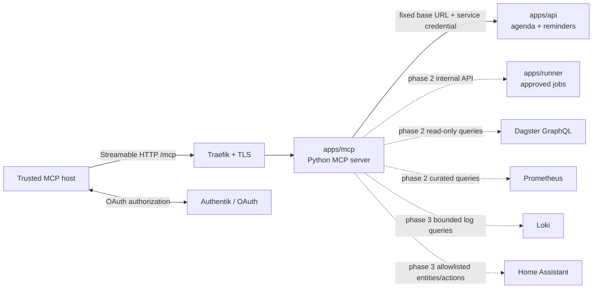

# Homelab MCP Server

## Goal

Build a private Model Context Protocol server that gives trusted AI clients a small, typed, auditable interface to homelab data and approved actions.

The first useful version should answer questions such as:

- What is on today's agenda?
- Which reminders are active or due soon?
- Are the important homelab applications healthy?
- Which approved jobs are available, and when did they last run?
- Create or complete a reminder after explicit user confirmation.

The server should compose existing application APIs rather than become a second database API, a general Kubernetes administrator, or an arbitrary command runner.

## Terminology

This proposal uses "MCP app" to mean a homelab-owned MCP server deployed as an application workload. It does not initially include an [MCP Apps](https://modelcontextprotocol.io/extensions/apps/overview) interactive UI rendered inside an MCP host. A custom UI could be added later if a use case needs more than structured tool results.

## Review Scope

This assessment was made on 2026-07-25 from the repository's declarative state at commit `2526dc2`. The configured Kubernetes API at `127.0.0.1:6443` was not reachable, so deployed pod health, live release state, and cluster capacity were not verified.

## Implementation Status

Phase 1 was implemented on 2026-07-25 under [apps/mcp](../../apps/mcp/). The service uses the stable MCP Python SDK v1 line with stateless Streamable HTTP, exposes the five proposed read-only tools and the agenda, active-reminders, and service-health resources, and includes structured logging, metrics, tests, a non-root image, Helmfile, Tilt, SOPS, and CI integration.

The release has a ClusterIP Service and no ingress. Tilt provides a local port-forward for development. Remote OAuth, TLS, mutation tools, Runner, Dagster, Prometheus query, Loki, and Home Assistant adapters remain future phases.

The initial MCP credential duplicates the API app's current single API key in a separately encrypted SOPS file. Replace this with an independently rotatable service credential when the API supports multiple credentials or audience-restricted service authentication.

## Current Homelab Findings

The repository already has most of the application boundaries an MCP server needs:

- [The API app](../../apps/api/) is a Python 3.14 FastAPI service with typed reminders, agenda, and upcoming-events endpoints. Those endpoints use an `X-Homelab-Api-Key` when `API_KEY` is configured.
- [The Agenda app](../../apps/agenda/) demonstrates that the API is already treated as the source for personal agenda and reminder data.
- [The Runner app](../../apps/runner/) discovers only labeled Kubernetes CronJobs, lists run history, and creates one-off Jobs from approved templates. Its service account is namespace-scoped and cannot edit arbitrary workloads.
- [Dagster](../../apps/dagster/) owns scheduled reminders, event, and Google Calendar pipelines and already records run state in PostgreSQL.
- Prometheus, Grafana, Loki, and Promtail provide the monitoring and logging substrate needed for operational summaries.
- Home Assistant and Mosquitto provide a future home-automation surface.
- Authentik is the identity provider, with the `homelab-admins` group used as the current administrator boundary.
- The local [workload chart](../../charts/workload/) already supports the deployment shape needed by a stateless Python MCP server: one container, a ClusterIP Service, ingress, probes, environment-backed secrets, a service account, resource limits, and a ServiceMonitor.
- The image build, Helmfile, Tilt, registry, structured logging, Ruff, ty, pytest, and focused CI patterns can all be copied from the API and Runner apps.

The important gaps are architectural rather than infrastructural:

- The current `.home` ingress and Authentik endpoints are HTTP-only. The MCP OAuth specification requires HTTPS for authorization-server endpoints and non-loopback redirect URIs.
- Existing Authentik integrations implement conventional browser OIDC login and application sessions. A protected remote MCP server is an OAuth resource server and also needs protected-resource metadata, bearer-token audience validation, and MCP client registration compatibility.
- Runner authentication is browser-session based. The MCP server must not scrape a browser session or receive a user's Runner token; Runner needs a separate service-to-service contract before MCP can invoke it safely.
- The API key is optional in API code when unset. Production MCP configuration should fail closed if a required downstream credential is absent.
- The workload chart does not currently expose NetworkPolicy or pod/container security-context values. Those controls would require a narrow chart addition or a separately validated manifest.
- A `.home` endpoint is reachable only from the LAN or a VPN. A cloud-hosted MCP client cannot call `mcp.home` directly, and publishing the endpoint through a tunnel would materially expand its threat model.

## Recommendation

Create a dedicated `apps/mcp` Python service and keep the existing API, Runner, Dagster, Prometheus, Loki, and Home Assistant services as systems of record.

A dedicated service is preferable to adding MCP directly to `apps/api` because it:

- Keeps the internet/client-facing protocol and authorization boundary separate from the personal-data REST API.
- Allows MCP dependencies and protocol upgrades without coupling them to Agenda.
- Provides one place to apply tool-level policy, scope checks, redaction, rate limits, and audit logging.
- Lets the server call only curated downstream adapters instead of inheriting direct database access.
- Can remain read-only while the underlying REST API continues supporting normal application writes.

Start with one server named `homelab`, but organize its adapters and tool registration by domain. If the surface grows, split it into `homelab-personal` and `homelab-ops`; personal data and cluster administration do not need to share one credential or failure domain indefinitely.

## Proposed Architecture



The MCP server should use typed adapter classes such as `HomelabApiClient`, `RunnerClient`, `DagsterClient`, `PrometheusClient`, and `HomeAssistantClient`. Tool functions should validate MCP inputs, call one adapter operation, normalize downstream failures, and return small structured models. They should not contain raw HTTP calls, Kubernetes logic, or query strings inline.

## Python and Protocol Shape

Use the official [MCP Python SDK](https://github.com/modelcontextprotocol/python-sdk) with `uv`, Pydantic models, `httpx`, Prometheus metrics, and the repository's existing structured logging conventions.

As of 2026-07-25, the SDK's `v1.x` line is the stable production recommendation and `v2` is still pre-release. If implementation begins before stable v2 is available, pin `mcp>=1.27,<2`; if it begins after the announced v2/spec release, run a short compatibility spike and pin the chosen major version rather than taking an unbounded dependency. The protocol layer should be thin enough that an SDK-major migration does not affect downstream adapters.

Use Streamable HTTP at `/mcp` for the deployed server. SSE is superseded for new remote servers, while stdio remains useful for a local development harness. Prefer stateless HTTP and JSON responses unless a proven tool requires server-side session state or streaming.

Do not enable experimental MCP Tasks in v1. They could eventually represent long-running Dagster or Kubernetes jobs, but the 2025-11-25 specification still labels Tasks experimental and Runner already provides durable run IDs and status.

## Proposed MCP Surface

MCP primitives should have distinct jobs:

- Resources expose bounded, read-only context that a host may attach to a conversation.
- Tools perform parameterized reads or actions chosen by the model and approved by the user as appropriate.
- Prompts provide user-selected workflow templates; they should not hide privileged behavior.

### V1 Tools

| Tool              | Behavior                                                                                              | Downstream                  | Risk                     |
| ----------------- | ----------------------------------------------------------------------------------------------------- | --------------------------- | ------------------------ |
| `agenda_today`    | Return events, active reminders, due-soon reminders, freshness, and the requested time window         | `GET /v1/agenda/today`      | Read-only                |
| `events_upcoming` | Return upcoming events for a bounded 1-168 hour window                                                | `GET /v1/events/upcoming`   | Read-only                |
| `reminders_list`  | List reminders with bounded pagination and optional completed items                                   | `GET /v1/reminders`         | Read-only, personal data |
| `reminder_get`    | Return one reminder by numeric ID                                                                     | `GET /v1/reminders/{id}`    | Read-only, personal data |
| `reminder_create` | Create a reminder from typed fields                                                                   | `POST /v1/reminders`        | Mutating; confirm        |
| `reminder_update` | Update explicitly supplied fields, including completion                                               | `PATCH /v1/reminders/{id}`  | Mutating; confirm        |
| `services_health` | Check a fixed allowlist of internal health endpoints and return status/latency without arbitrary URLs | Direct internal HTTP checks | Read-only                |

Tool inputs should use the same date, pagination, and time-window bounds as the REST API. Tool outputs should declare structured schemas and avoid returning full downstream HTTP responses.

The first release can ship `reminder_create` and `reminder_update` disabled by configuration while the read-only surface and authentication are exercised. Enabling a write tool should be an explicit deployment change.

### Phase 2 Tools

| Tool                | Behavior                                                                    | Required enabling work                                                            |
| ------------------- | --------------------------------------------------------------------------- | --------------------------------------------------------------------------------- |
| `jobs_list`         | List approved labeled jobs and recent state                                 | Add an authenticated internal Runner API                                          |
| `job_runs`          | Return bounded run history and the existing Grafana link                    | Add an authenticated internal Runner API                                          |
| `job_run`           | Launch one already-approved runnable by app/name and return its run ID      | Add service auth, tool scope, duplicate-run protection, and explicit confirmation |
| `pipelines_status`  | Summarize selected Dagster schedules, freshness, and recent failures        | Add a typed, read-only Dagster GraphQL adapter                                    |
| `metrics_summary`   | Return curated capacity and error-rate summaries                            | Define fixed PromQL templates and bounds                                          |
| `service_incidents` | Return a redacted error summary for one allowlisted service and time window | Define fixed LogQL templates, result limits, and redaction tests                  |

`job_run` should call Runner rather than receive Kubernetes RBAC itself. Runner is already the policy boundary that checks the runnable label, resolves approved CronJob templates, prevents concurrent duplicate runs, and creates Jobs with namespace-scoped permissions.

### Phase 3 Tools

- `home_status`: summarize a fixed list of Home Assistant entities such as doors, temperatures, batteries, and alarm state.
- `home_action`: invoke only named, low-risk Home Assistant scripts rather than arbitrary domains/services/entities.
- `backup_status`: summarize last backup timestamps, artifact validation, and retention without exposing backup credentials or object paths containing sensitive data.
- `pipeline_run`: launch an allowlisted Dagster job and return its run ID after the same authorization and confirmation controls used for Runner.

High-impact home actions such as locks, garage doors, alarms, cameras, and security modes should remain out of scope until there is a separate policy and confirmation design.

### Resources

Start with a few stable custom URIs:

```text
homelab://agenda/today
homelab://reminders/active
homelab://services/health
homelab://jobs/runnables
```

Resources should return concise JSON or Markdown generated from live APIs. Avoid mounting the repository into the server just to expose notes: that creates another documentation deployment path and can silently serve a revision different from the running cluster.

Resource subscriptions are unnecessary in v1. Polling on explicit reads is simpler and current data changes infrequently enough for a personal homelab.

### Prompts

Prompts are optional and should follow working tools rather than lead the implementation:

- `daily_briefing`: use agenda, reminder, and pipeline-freshness context to prepare a short daily summary.
- `triage_service`: inspect one service's health, recent metrics, and bounded error summary, then propose checks without making changes.
- `prepare_maintenance`: summarize active reminders, relevant service health, and available approved maintenance jobs before the user chooses an action.

## Useful Scenarios

### Daily personal assistant

> Give me today's agenda, call out reminders due soon, and tell me whether calendar data is stale.

This composes the existing agenda endpoint and its freshness metadata without granting the model direct PostgreSQL or Google Calendar access.

### Conversational reminder management

> Remind me to replace the HVAC filter next Saturday, then mark reminder 42 complete.

The model maps natural language into the existing typed reminder contract. The client should show the exact create/update arguments before the write is approved.

### Morning homelab check

> Are the API, Runner, Dagster, Grafana, and Home Assistant healthy? Show only anything abnormal.

The MCP server runs fixed internal health checks and later augments failures with curated Prometheus and Loki summaries.

### Pipeline freshness

> Did calendar and sports ingestion run successfully today, and which source is stale?

The answer combines Dagster run status with the freshness fields already exposed by Agenda. It should link to Dagster or Grafana for detail instead of dumping large logs into model context.

### Safe operational jobs

> List maintenance jobs I can run. Run the reminders row-count check after I approve it.

Runner remains the executor and allowlist. The MCP layer improves discovery and conversational access but does not create arbitrary Job specifications.

### Home Assistant context

> Which batteries are low, which doors are open, and are any temperatures outside their normal range?

This is a good read-only phase 3 use case because it turns many entity states into a small structured summary. Write operations should be limited to prebuilt Home Assistant scripts with clear names and effects.

### Incident triage

> Why is Agenda failing?

The server checks its health endpoint, dependency health, a fixed error-rate query, recent redacted error logs, and pipeline freshness. It returns evidence and links; it does not restart pods or apply manifests.

## Security Model

An MCP server turns model output into authenticated actions, so LAN-only placement is useful but not sufficient.

### Authentication and transport

The production target should be `https://mcp.<private-domain>/mcp` or another TLS-protected private endpoint reachable through the LAN/VPN. Before deployment as a remote server:

1. Add trusted TLS for the MCP resource URL and Authentik authorization endpoints.
2. Verify the target MCP clients' support for private DNS, private certificate authorities, OAuth client registration, and the chosen protocol version.
3. Configure the MCP server as an OAuth resource server with RFC 9728 protected-resource metadata.
4. Validate bearer signature, issuer, audience/resource, expiry, and scopes on every HTTP request; sessions must not be used as authentication.
5. Confirm Authentik can provide the discovery and client-registration mode required by the selected clients. Prefer pre-registered clients initially if supported by both sides.

The existing reusable Authentik Terraform module is a useful starting point but is not sufficient by itself: it provisions a confidential web client and callback URL, while the MCP server must validate tokens issued specifically for its resource identifier.

For the first development spike, avoid pretending that plain HTTP plus a shared header is production OAuth. Run the server with stdio or use a loopback `kubectl port-forward` to an unauthenticated read-only instance. Do not publish an unauthenticated MCP ingress.

### Authorization

Use progressive scopes rather than one administrator scope:

```text
homelab:personal:read
homelab:reminders:write
homelab:ops:read
homelab:jobs:run
homelab:home:read
homelab:home:control
```

Read-only discovery should require the smallest applicable scope. Write tools should return an insufficient-scope challenge for their specific scope instead of encouraging every client to request all permissions up front.

Group membership can remain a coarse admission check, but tools must enforce scopes independently. `homelab-admins` should not automatically imply every future home-control permission.

### Downstream credentials

- Store the API key, Runner service credential, Home Assistant token, and any other downstream credentials in `apps/mcp/secrets.sops.yaml` or Terraform-created Kubernetes Secrets.
- Give each downstream integration its own credential so it can be rotated and audited independently.
- Never accept a client bearer token and pass it to API, Runner, Dagster, or Home Assistant. The MCP server validates its own token and uses server-owned downstream credentials.
- Do not log authorization headers, API keys, tool arguments containing personal data, downstream response bodies, or secret-bearing URLs.
- Production startup should fail if authentication, required scopes, or a configured downstream credential is absent.

### Tool safety

- Mark read tools with the SDK's read-only annotations and mutation tools with accurate destructive/idempotency/open-world hints where the selected SDK version supports them. Treat annotations as hints, not enforcement.
- Require the MCP host to keep a human in the loop for mutations, and enforce server-side authorization even if the host claims it confirmed an action.
- Use explicit Pydantic bounds for IDs, date windows, list sizes, text lengths, enum values, and time ranges.
- Hardcode or configure downstream base URLs; never let a tool caller provide a URL, Kubernetes namespace, SQL, PromQL, LogQL, or Home Assistant service name.
- Apply timeouts, response-size limits, concurrency limits, and per-identity rate limits.
- Return stable error categories such as unavailable, unauthorized, forbidden, invalid input, conflict, and not found without leaking internal stack traces.
- Include an audit record for every write attempt with timestamp, authenticated subject, client ID, tool name, request/correlation ID, outcome, and affected object ID. Redact free-text reminder content from the audit log.

### Explicitly forbidden tools

Do not expose:

- Arbitrary shell commands, `kubectl`, pod exec, or container logs.
- Kubernetes Secret reads.
- Arbitrary SQL, PromQL, LogQL, GraphQL, or HTTP fetches.
- Manifest apply/delete/patch operations.
- Generic Kubernetes Job creation.
- Generic Home Assistant service calls.
- SOPS decryption, backup credential access, or raw database credentials.
- Camera streams, stored Frigate footage, calendar attendee details, or unredacted private logs without a separate data policy.

## Internal Service Contracts

### Homelab API

V1 should call the existing REST API rather than connect to PostgreSQL. Use the in-cluster base URL, send `X-Homelab-Api-Key`, preserve request IDs, and map the existing response models into MCP output models.

The API should eventually make its production API-key requirement explicit rather than silently disabling authentication when `API_KEY` is empty. That hardening can be done independently of the MCP app.

### Runner

Add a separate `/internal/v1` service API or equivalent machine-auth dependency to Runner:

- Use a dedicated service credential or audience-restricted token, not the browser session cookie.
- Keep the same runnable-label check and namespace restriction for service calls.
- Expose only list, history, and run operations already supported by Runner.
- Record the originating MCP subject and request ID as audit metadata where practical.
- Rate-limit launches and preserve the existing active-run conflict check.

This avoids duplicating Kubernetes client code and prevents the MCP service account from gaining Job creation permissions.

### Prometheus and Loki

Define named server-side queries such as `cluster_capacity`, `service_error_rate`, and `recent_service_errors`. Parameters may select from an allowlisted service and bounded time range, but callers must not supply query text.

Return aggregates and small samples. Raw log volume consumes context quickly and may contain tokens, personal data, headers, or third-party payloads.

### Home Assistant

Use a dedicated Home Assistant identity/token. Read only an allowlist of entity IDs in the first iteration. If controls are added, expose prebuilt HA scripts that encode the allowed target and behavior rather than accepting arbitrary `domain`, `service`, and `entity_id` values.

## Repository and Deployment Plan

Suggested app layout:

```text
apps/mcp/
├── Dockerfile
├── pyproject.toml
├── uv.lock
├── values.yaml
├── values-dev.yaml.gotmpl
├── secrets.sops.yaml
├── src/
│   ├── main.py
│   ├── config.py
│   ├── auth.py
│   ├── logging_config.py
│   ├── metrics.py
│   ├── models/
│   ├── adapters/
│   └── tools/
└── tests/
```

Implementation should also update:

- `helmfile.yaml` with an `apps` namespace release using `./charts/workload`, `bootstrap: app`, and dependencies on the registry and the downstream releases required at startup.
- `Tiltfile` to add `mcp` to `APP_NAMES`, live-sync `src`, and link the local MCP endpoint and health endpoint.
- `terraform/authentik.tf` and possibly the reusable OIDC module after the MCP authorization compatibility spike.
- `.github/workflows/python-quality.yaml` so `apps/mcp` is included in ty change detection and uses Python 3.14.
- `.pre-commit-config.yaml` so the local changed-app ty hook includes `apps/mcp`.
- A focused `apps/mcp` test workflow if the API/Runner workflow pattern remains the repository convention.

Suggested Helm values:

- Python 3.14 image built with the same non-root multi-stage pattern as API and Runner.
- `service.port: 8000`.
- `/healthz`, `/readyz`, and `/metrics` endpoints outside the MCP JSON-RPC path.
- A `ServiceMonitor`.
- Conservative requests around `25m` CPU and `128Mi` memory, with limits similar to API until measurements justify changes.
- One replica initially. Stateless Streamable HTTP allows later replication.
- A ClusterIP Service and private ingress only after TLS/auth are complete.
- Fixed internal service URLs in normal values and credentials in `secretEnv`.
- `needs` on `registry/registry`, `apps/api`, and `monitoring/prometheus-operator` as required by the enabled adapter set.

If NetworkPolicy and security contexts are added only for MCP, use a small separately validated manifest instead of broadening the shared workload chart prematurely. If several app-owned workloads need the same controls, add backward-compatible chart values and helm-unittest coverage.

## Observability

Follow the API's structured JSON logging model and add MCP-specific low-cardinality fields:

- `request_id`
- authenticated subject identifier or a stable one-way hash
- OAuth client ID
- tool/resource name
- result category
- duration
- downstream service

Do not log raw arguments or results by default. A reminder message, calendar event, Home Assistant state, or log excerpt may be personal even when it does not contain a formal secret.

Initial metrics:

```text
mcp_requests_total{method,result}
mcp_request_duration_seconds{method}
mcp_tool_calls_total{tool,result}
mcp_tool_duration_seconds{tool}
mcp_downstream_requests_total{service,operation,result}
mcp_downstream_request_duration_seconds{service,operation}
mcp_auth_failures_total{reason}
```

Keep tool names as bounded labels and never add subject, reminder ID, run ID, request ID, entity ID, or error message as a Prometheus label.

## Testing Strategy

- Unit-test every tool's validation, scope requirement, output shape, annotations, and error mapping.
- Test adapters with `httpx.MockTransport` or an equivalent fake transport; do not require a live cluster for normal tests.
- Add protocol-level tests using the SDK's in-memory transport or client to verify tool/resource discovery and structured results.
- Test that disabled mutation tools are absent, not merely rejected after discovery.
- Test production fail-closed configuration for missing auth settings and credentials.
- Add adversarial tests for oversized inputs, unsupported service names, arbitrary URLs/query text, missing scopes, and downstream data containing secrets.
- Verify health and metrics routes independently from `/mcp`.
- Use the official MCP Inspector for manual discovery and invocation during development.
- Run the repository's Ruff, formatting, ty, pytest, image build, Helmfile render, kubeconform, kube-linter, and manifest validation paths before deployment.

## Delivery Phases

### Phase 0: Client and authorization spike

1. Choose the first MCP host and confirm whether it can reach private DNS or a VPN endpoint.
2. Verify Streamable HTTP, OAuth discovery, client registration, scope challenge, and private-CA behavior against Authentik.
3. Decide the private TLS name and certificate strategy.
4. Pin the stable Python SDK major after checking the release state at implementation time.
5. Prove one no-op or health tool through the MCP Inspector and the target host.

Exit criterion: a client can authenticate to a TLS endpoint, discover one tool, call it, and receive an auditable identity at the server.

### Phase 1: Read-only personal context

1. Scaffold `apps/mcp` using the API app's Python, Docker, test, logging, metrics, Helm, Tilt, and CI patterns.
2. Add the API adapter.
3. Implement `agenda_today`, `events_upcoming`, `reminders_list`, `reminder_get`, and fixed `services_health`.
4. Add the agenda, active-reminders, and health resources.
5. Deploy privately with only `homelab:personal:read`.

Exit criterion: the server provides useful daily context without any database connection, Kubernetes RBAC, or mutation capability.

### Phase 2: Controlled writes and operations

1. Add reminder write scopes and enable create/update only after client confirmations are verified.
2. Add Runner service-to-service authentication and the jobs read tools.
3. Add `job_run` with its own scope, audit trail, rate limit, and confirmation.
4. Add typed Dagster and curated Prometheus adapters.

Exit criterion: every mutation uses an existing application policy boundary, has a narrow scope, and produces an audit event.

### Phase 3: Rich operations and home context

1. Add redacted, bounded Loki incident summaries.
2. Add Home Assistant read-only entity summaries.
3. Add backup health and restore-readiness context.
4. Reassess whether personal and operational tools should split into separate MCP servers.
5. Consider MCP Tasks or an MCP Apps UI only for a concrete use case.

## Open Decisions

- Which MCP host is the first consumer, and can it access a LAN/VPN-only endpoint?
- Should the permanent endpoint remain private through a VPN, or must a cloud-hosted client reach it?
- What certificate authority and private DNS name should replace HTTP-only `mcp.home` and Authentik URLs?
- Does the installed Authentik version support the MCP client's required registration flow, or is a small authorization gateway needed?
- Should reminder writes be enabled in the first deployed release or follow a read-only burn-in period?
- Which services belong in the initial health allowlist?
- Is the Runner internal API best protected by a static SOPS-managed service token, a Kubernetes service-account token with explicit audience, or Authentik client credentials?
- Which Home Assistant entities are safe and useful enough for an allowlist?

## Success Criteria

- A trusted MCP client can connect through a private TLS endpoint and authenticate as an identifiable user/client.
- The initial tool catalog is small, typed, and read-only by default.
- Personal data comes through the existing API rather than direct SQL.
- The MCP pod has no Kubernetes write RBAC.
- No tool accepts arbitrary commands, URLs, query languages, namespaces, or Home Assistant service names.
- Every mutation requires a separate scope, explicit user confirmation, server-side validation, and an audit event.
- Downstream credentials are independently scoped, encrypted, redacted, and never passed through from the MCP client.
- Health, readiness, metrics, structured logs, unit tests, protocol tests, and rendered-manifest validation follow existing repository patterns.

## References

- [MCP architecture](https://modelcontextprotocol.io/docs/learn/architecture)
- [Build an MCP server](https://modelcontextprotocol.io/docs/develop/build-server)
- [MCP 2025-11-25 authorization specification](https://modelcontextprotocol.io/specification/2025-11-25/basic/authorization)
- [MCP security best practices](https://modelcontextprotocol.io/docs/tutorials/security/security_best_practices)
- [MCP tools specification](https://modelcontextprotocol.io/specification/2025-11-25/server/tools)
- [MCP resources specification](https://modelcontextprotocol.io/specification/2025-11-25/server/resources)
- [MCP Tasks](https://modelcontextprotocol.io/specification/2025-11-25/basic/utilities/tasks)
- [Official MCP Python SDK](https://github.com/modelcontextprotocol/python-sdk)
- [MCP Inspector](https://modelcontextprotocol.io/docs/tools/inspector)
- [Homelab API](../../apps/api/README.md)
- [Homelab Runner](../../apps/runner/README.md)
- [Homelab Dagster](../../apps/dagster/README.md)
- [Authentik architecture](../services/authentik.md)
- [Private/public network split](../services/private-public-app-split.md)
