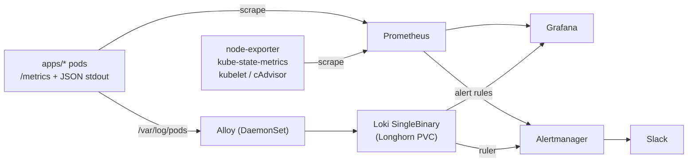

# Monitoring

Metrics, logs, dashboards, and alerting for the homelab cluster. Everything is declared in Git: kube-prometheus-stack (Prometheus, Alertmanager, Grafana) in `services/prometheus/`, Loki in `services/loki/`, the Alloy log shipper in `services/alloy/`, and dashboards in `services/grafana/dashboards/`. There is no SaaS observability tooling.

## Overview

Apps expose Prometheus metrics on `/metrics` and write one JSON log line per event to stdout. Prometheus scrapes the metrics through each app's ServiceMonitor. Alloy tails every pod's log file and pushes to Loki, which stores chunks on a Longhorn volume. Prometheus rules and the Loki ruler both send alerts to Alertmanager, which routes them to Slack.



## Quick links

| What                             | URL                                                                                                           |
| -------------------------------- | ------------------------------------------------------------------------------------------------------------- |
| Grafana home                     | [grafana.home](http://grafana.home)                                                                           |
| Services Overview dashboard      | [grafana.home/d/services-overview](http://grafana.home/d/services-overview/services-overview)                 |
| Kubernetes compute (cluster)     | [grafana.home/d/efa86fd1d0c121a26444b636a3f509a8](http://grafana.home/d/efa86fd1d0c121a26444b636a3f509a8)     |
| Kubernetes compute (namespace)   | [grafana.home/d/85a562078cdf77779eaa1add43ccec1e](http://grafana.home/d/85a562078cdf77779eaa1add43ccec1e)     |
| Node exporter                    | [grafana.home/d/7d57716318ee0dddbac5a7f451fb7753](http://grafana.home/d/7d57716318ee0dddbac5a7f451fb7753)     |
| Loki logs dashboard              | [grafana.home/d/loki-logs](http://grafana.home/d/loki-logs)                                                   |
| Grafana Explore (Loki)           | [grafana.home/explore](http://grafana.home/explore) (pick the Loki datasource)                                |
| Prometheus targets               | [prometheus.home/targets](http://prometheus.home/targets)                                                     |
| Prometheus alerts                | [prometheus.home/alerts](http://prometheus.home/alerts)                                                       |
| Alertmanager alerts              | [alertmanager.home](http://alertmanager.home/#/alerts)                                                        |
| Alertmanager silences            | [alertmanager.home/#/silences](http://alertmanager.home/#/silences)                                           |
| Loki API and ruler (not exposed) | `kubectl -n monitoring port-forward svc/loki-gateway 3100:80`, then `http://localhost:3100/loki/api/v1/rules` |

Explore requires the `homelab-admins` group; other SSO users are Grafana Viewers.

## Server metrics

kube-prometheus-stack collects:

- **node-exporter**: host CPU, memory, disk, filesystem, and network.
- **kube-state-metrics**: object state such as pod phase, restarts, resource requests and limits, and PVC status.
- **kubelet and cAdvisor**: per-container CPU, memory, and throttling.

Prometheus keeps the chart default 10 days of data on a 10Gi Longhorn PVC. Start with the Kubernetes compute and Node exporter dashboards above.

On K3s the scheduler, controller-manager, and kube-proxy run inside the k3s process and bind to localhost, and there is no etcd. `services/prometheus/values.yaml` therefore disables those scrape targets and their default rules, plus `KubeCPUOvercommit` and `KubeMemoryOvercommit`, which always fire on a single node. Revisit this after the Talos migration.

## Application metrics

Every app exports the same two HTTP metrics, so one query or panel covers all of them. The ServiceMonitor adds the `app` label (the Helm release name, same as the Loki `app` label), so metric names carry no service prefix.

| Metric                                 | Type      | Labels                      |
| -------------------------------------- | --------- | --------------------------- |
| `http_server_requests_total`           | counter   | `method`, `route`, `status` |
| `http_server_request_duration_seconds` | histogram | `method`, `route`           |

`route` is always a template (`/v1/reminders/{reminder_id}`, `/reminders/[id]/edit`), never the raw path. Unknown paths and 404s collapse to `unmatched`, which keeps cardinality bounded. Unhandled exceptions are still counted as `status="500"`.

| App      | Endpoint        | Library                                           | Extra metrics                                       | ServiceMonitor            |
| -------- | --------------- | ------------------------------------------------- | --------------------------------------------------- | ------------------------- |
| `api`    | `:8000/metrics` | `prometheus_client`, `src/http_observability.py`  | none                                                | `apps/api/values.yaml`    |
| `mcp`    | `:8000/metrics` | `prometheus_client`, `src/http_observability.py`  | `mcp_tool_calls_total`, `mcp_tool_duration_seconds` | `apps/mcp/values.yaml`    |
| `runner` | `:8080/metrics` | `prometheus_client`, `src/http_observability.py`  | none                                                | `apps/runner/values.yaml` |
| `django` | `:8000/metrics` | `prometheus_client`, `src/core/observability.py`  | none                                                | `apps/django/values.yaml` |
| `agenda` | `:3000/metrics` | `prom-client`, `src/server/http-observability.ts` | Node.js process defaults (`process_*`, `nodejs_*`)  | `apps/agenda/values.yaml` |

The ServiceMonitor itself is rendered by `charts/workload/templates/servicemonitor.yaml` when `serviceMonitor.enabled: true`.

Not instrumented, on purpose:

- `workload-chart-example`: frozen reference app. It has its own `random_string_api_*` metrics and does not follow the shared schema.
- `dagster-*`: third-party webserver and daemon with no native Prometheus endpoint. Run failures are visible in the Dagster UI.

## Application logs

### Schema

Every app writes one JSON object per line to stdout with these fields. Python apps set them in `logging_config.py` (Django: `core/log_format.py`); agenda uses pino in `src/server/logger.ts`.

| Field                    | Description                                                                                                                    |
| ------------------------ | ------------------------------------------------------------------------------------------------------------------------------ |
| `time`                   | RFC3339 timestamp                                                                                                              |
| `level`                  | `debug`, `info`, `warn`, `error`                                                                                               |
| `msg`                    | Human-readable message; access lines use `request completed` or `request failed`                                               |
| `service`                | App name (matches the Loki `app` label)                                                                                        |
| `logger`                 | Python logger name (Python apps only)                                                                                          |
| `environment`, `version` | Python apps only                                                                                                               |
| `method`                 | HTTP method                                                                                                                    |
| `route`                  | Route template, same value as the metric label                                                                                 |
| `path`                   | Raw request path (log field only, never a label)                                                                               |
| `status`                 | HTTP status code (number)                                                                                                      |
| `duration_ms`            | Request duration in milliseconds                                                                                               |
| `request_id`             | From `X-Request-ID` or generated; echoed back in the response header and attached to every log line emitted during the request |
| `client_ip`              | First `X-Forwarded-For` hop, else the socket peer                                                                              |
| `error`                  | `ExceptionType: message` when an exception is logged                                                                           |
| `exception`              | Full traceback or stack, kept in one field so it stays on one line                                                             |

Each request produces exactly one access line; uvicorn's and Django runserver's own access logs are disabled. Some lines are still plain text, which the `| json | __error__=""` filters skip: process startup banners, and Next.js's own multi-line error print (agenda also logs a JSON `request error` line for the same failure via `src/instrumentation.ts`).

### Flow, retention, and labels

Alloy (`services/alloy/values.yaml`) runs as a DaemonSet, tails `/var/log/pods`, strips the CRI prefix, and pushes to `loki-gateway`. Loki runs in SingleBinary mode with the filesystem store on a 5Gi Longhorn PVC and 7-day retention (`services/loki/values.yaml`).

Loki labels are `namespace`, `app`, `instance`, `component`, `pod`, `container`, `node_name`, `job` (`<namespace>/<app>`), `stream`, and `filename`, the same set Promtail used to produce. `namespace`, `app`, `pod`, and `container` match the Prometheus label names, so the Services Overview variables filter both. Request-level fields (`request_id`, `route`, `status`, user data) stay in the log body. Never promote them to labels, because every distinct value creates a new stream.

### Useful LogQL

```logql
# Errors for one app
{namespace="apps", app="api"} | json | level="error"

# 5xx responses by route over the last hour
sum by (route) (count_over_time({namespace="apps", app="api"} | json | __error__="" | status >= 500 [1h]))

# Slowest requests
{namespace="apps"} | json | __error__="" | duration_ms > 500 | line_format "{{.service}} {{.method}} {{.route}} {{.status}} {{.duration_ms}}ms"

# Everything logged for one request
{namespace="apps"} | json | request_id="<id from the X-Request-ID response header>"

# Unhandled exceptions with tracebacks
{namespace="apps"} | json | level="error" | exception != ""
```

## Alerting

### Custom alerts

| Alert                            | Source     | Expression summary                                                         | Threshold    | Severity | Rule file                                 |
| -------------------------------- | ---------- | -------------------------------------------------------------------------- | ------------ | -------- | ----------------------------------------- |
| `AppHighHttpErrorRate`           | Prometheus | 5xx share of `http_server_requests_total`, probes and scrapes excluded     | > 5% for 2m  | critical | `services/prometheus/values.yaml`         |
| `AppHighHttpLatency`             | Prometheus | p95 of `http_server_request_duration_seconds`, probes and scrapes excluded | > 1s for 10m | warning  | `services/prometheus/values.yaml`         |
| `AppMetricsTargetDown`           | Prometheus | `up{namespace="apps"} == 0`                                                | 5m           | warning  | `services/prometheus/values.yaml`         |
| `AppHighHttp5xxRateFromLogs`     | Loki       | share of access lines with `status >= 500`, probes and scrapes excluded    | > 5% for 2m  | critical | `services/loki/rules/app-log-alerts.yaml` |
| `AppUnhandledExceptionsFromLogs` | Loki       | `level="error"` lines with an `exception` field                            | > 0 in 5m    | warning  | `services/loki/rules/app-log-alerts.yaml` |

The default kube-prometheus-stack rules (minus the K3s exclusions above) cover nodes, pods, PVCs, and Prometheus itself.

**Metrics are the primary signal.** Counters are cheap, survive log sampling or shipping delays, and are what the dashboard uses. The Loki rules are a cross-check that works even when a scrape is failing, and they are the only source that can say which exception happened. Both 5xx alerts firing together is expected; the notification text shows the source.

### Routing

Alertmanager config lives under `alertmanager.config` in `services/prometheus/values.yaml`, with the Slack message template under `alertmanager.templateFiles`.

- **Toggle:** set `alertmanager.enabled: false` in `services/prometheus/values.yaml` and run `make sync` to turn off alert delivery. Rules still evaluate and stay visible on the Prometheus alerts page. The Loki ruler logs failed notifications until Alertmanager is back.
- **Receivers:** `critical` and `warning` go to the `slack` receiver. `info` alerts, `Watchdog`, and `InfoInhibitor` go to the `null` receiver.
- **Grouping:** by `alertname`, `namespace`, and `app`, with a 30s group wait, 5m group interval, and 4h repeat. Resolved notifications are sent.
- **Inhibition:** a critical alert mutes the warning with the same `alertname` and `namespace`, and a critical app alert mutes that app's warnings (for example, the 5xx alert mutes the exception alert during one incident).
- **Slack messages:** each includes severity, rule source, namespace/app, summary, description, and runbook link, plus links to the Services Overview dashboard filtered to the app, a pre-filled silence, and Alertmanager.
- **Grafana alerting:** Grafana-managed alerting is not used. Keep it that way to avoid duplicate notifications.

**Slack wiring:**

- The webhook URL is stored only in the SOPS file `services/prometheus/secrets.sops.yaml` under `alertmanagerSlack.webhookUrl`.
- The chart renders it into the `monitoring/alertmanager-slack` Secret (key `webhook-url`), which Alertmanager mounts and reads through `api_url_file`.
- Until the placeholder is replaced, Slack sends fail and Alertmanager logs the errors.

### Operations

**Rotate or set the webhook:**

1. Run `sops services/prometheus/secrets.sops.yaml` and replace `alertmanagerSlack.webhookUrl`.
2. Run `make sync`. Alertmanager rereads the file on every send, so no restart is needed.

**Silence an alert:** use the Silence link in the Slack message, or create one at [alertmanager.home/#/silences](http://alertmanager.home/#/silences). From a shell:

```bash
kubectl -n monitoring exec alertmanager-prometheus-operator-kube-p-alertmanager-0 -c alertmanager -- \
  amtool silence add alertname=AppHighHttpLatency app=api --duration=2h --comment="deploying" \
  --alertmanager.url=http://localhost:9093
```

**Send a test alert.** It should show up in Slack within about 30s:

```bash
curl -X POST http://alertmanager.home/api/v2/alerts -H 'Content-Type: application/json' -d '[{
  "labels": {"alertname": "ManualTest", "severity": "warning", "namespace": "apps", "app": "api"},
  "annotations": {"summary": "Manual pipeline test", "description": "Sent by hand; safe to ignore."}
}]'
```

Resolve it by sending the same payload with `"endsAt":` set. The resolved notification arrives after the next group interval.

```bash
curl -X POST http://alertmanager.home/api/v2/alerts -H 'Content-Type: application/json' -d '[{
  "labels": {"alertname": "ManualTest", "severity": "warning", "namespace": "apps", "app": "api"},
  "annotations": {"summary": "Manual pipeline test", "description": "Sent by hand; safe to ignore."},
  "endsAt": "'"$(date -u +%Y-%m-%dT%H:%M:%SZ)"'"
}]'
```

**Trigger a real app failure (temporary clusters only):**

1. Scale Postgres to zero with `kubectl -n postgres scale statefulset postgres --replicas=0`.
2. Generate failing API requests from inside the pod, so the API key never leaves the container:

   ```bash
   kubectl -n apps exec deploy/api -- python -c '
   import os, urllib.request
   for _ in range(30):
       req = urllib.request.Request("http://localhost:8000/v1/reminders", headers={"X-Homelab-Api-Key": os.environ.get("API_KEY", "")})
       try:
           urllib.request.urlopen(req, timeout=10)
       except Exception as exc:
           print(exc)
   '
   ```

3. After about 2 minutes, `AppHighHttpErrorRate` and `AppHighHttp5xxRateFromLogs` fire.
4. Scale Postgres back to 1. The alerts resolve once the 5m window clears.

**Rule locations:**

- Loki rules load from ConfigMaps labelled `loki_rule: "1"`. The loki release's postsync hook applies `services/loki/rules/`, and the ruler sidecar picks them up.
- Prometheus rules come from `additionalPrometheusRulesMap`.

## Runbooks

### AppHighHttpErrorRate

More than 5% of real requests to an app returned 5xx, according to its metrics.

1. Open Services Overview for the app and check whether the errors cluster on one route in "Requests by route and status".
2. Check the Error logs panel or `{namespace="apps", app="<app>"} | json | level="error"` for the `error` and `exception` fields.
3. Check dependencies. For `api`, `django`, and `dagster`, that means Postgres (`kubectl -n postgres get pods`); `agenda` and `mcp` call `api`.
4. Check for a recent deploy or restart: `kubectl -n apps rollout history deploy/<app>` and the restarts panel.

### AppHighHttp5xxRateFromLogs

The same condition as `AppHighHttpErrorRate`, computed from access log lines. If it fires without the metric alert, check that Prometheus is scraping the app (`AppMetricsTargetDown`, [prometheus.home/targets](http://prometheus.home/targets)). Otherwise follow the steps above.

### AppHighHttpLatency

p95 latency above 1s for 10 minutes.

1. Use "p95 latency by route" to find the slow route.
2. Check CPU against its limit. Throttling at the limit is the usual cause in this cluster, since limits are small.
3. Check Postgres health and slow queries.
4. Use the slowest-requests LogQL query above to find example `request_id`s.

### AppMetricsTargetDown

Prometheus cannot scrape an app pod.

1. Check the pod: `kubectl -n apps get pods -l app.kubernetes.io/name=<app>`.
2. If it is running, curl the endpoint from inside the cluster, for example `kubectl -n apps exec deploy/<app> -- wget -qO- localhost:<port>/metrics`.
3. Confirm the ServiceMonitor exists: `kubectl -n apps get servicemonitor <app>`.

### AppUnhandledExceptionsFromLogs

An app logged a traceback. Query `{namespace="apps", app="<app>"} | json | exception != ""`, read the `error` and `exception` fields, and use `request_id` to see the whole request.

## Adding a new app or service

Every new app must follow the metric and log contract above, or record why it is exempt; see "Observability" in `AGENTS.md`. The quickest path for a Python app is to copy `logging_config.py`, `log_context.py`, `metrics.py`, and `http_observability.py` from `apps/api/src/`, change `SERVICE_NAME`, and set `serviceMonitor.enabled: true`.

## Future work

- Paging beyond Slack (ntfy or a phone push) for `critical`, plus a dead man's switch for `Watchdog`.
- Tracing with Tempo, propagating `request_id` as `trace_id` from agenda and mcp into api, with a Grafana derived field linking logs to traces.
- SLO-based burn-rate alerts to replace the fixed 5% threshold once there is steady traffic.
- Run Django under gunicorn instead of `runserver`.
