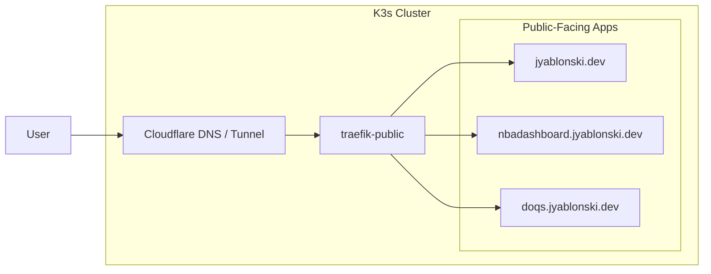

# Private/Public Homelab Split



## Goal

Keep the current homelab private on the LAN while adding a controlled path for a small set of public apps under `jyablonski.dev`.

Current private services should stay on `.home`:

- `apps.home`
- `grafana.home`
- `prometheus.home`
- `homeassistant.home`
- `authentik.home`
- `longhorn.home`
- `pihole.home`
- `registry.home`
- current app-owned private workloads such as `api.home`, `django.home`, and `runner.home`

Future public services can use real domain names:

- `jyablonski.dev`
- `nbadashboard.jyablonski.dev`
- `doqs.jyablonski.dev`
- other explicitly approved public app hosts

The root `jyablonski.dev` is a Next.js app today served through the AWS S3 -> CloudFront static-site path. This could get copied into this repo, and served out as static content via a Nginx Service in K3s if there's no need to use the server side rendering features.

```Dockerfile
FROM node:22-alpine AS build
WORKDIR /app
COPY package*.json ./
RUN npm ci
COPY . .
RUN npm run build

FROM nginx:alpine
COPY --from=build /app/out /usr/share/nginx/html
```

## Current Model

The repo is intentionally LAN-first.

- Pi-hole resolves `*.home` to the Traefik MetalLB IP.
- Traefik routes `.home` hostnames to private services.
- The local registry is exposed only on the LAN as `registry.home:5000`.
- Authentik/OIDC callback URLs are currently `.home` based.
- No public DNS record points at the cluster.

This should remain the default posture. The public path should be additive, not a replacement for `.home`.

## Recommended Public Model

Use Cloudflare Tunnel as the public entrypoint instead of opening router ports.

```text
Public browser
  -> Cloudflare DNS / edge TLS
  -> Cloudflare Tunnel
  -> cloudflared pods in K3s
  -> traefik-public
  -> public app Service
```

The tunnel is outbound from the cluster to Cloudflare, so the home router does not need inbound `80` or `443` port forwards. Cloudflare sees and serves the public hostnames, while the home IP remains hidden.

For a low-traffic personal setup, Cloudflare Tunnel is intended to fit in the free Cloudflare/Zero Trust tier. Treat this as "free for normal personal web apps", not as a license to proxy bulk media, backups, huge downloads, or anything that looks like CDN abuse. Re-check Cloudflare's current terms before putting high-bandwidth services behind it.

Cloudflare is in the public request path, but it is not in the build or image distribution path:

- Public users connect to Cloudflare.
- Cloudflare forwards matching HTTP requests through the tunnel.
- `cloudflared` forwards those requests to `traefik-public` inside the cluster.
- `traefik-public` forwards to the selected app Service.
- Kubernetes nodes still pull container images from whatever registry the Deployment references.

So Cloudflare can read/proxy public HTTP traffic for the hostnames you publish, but Cloudflare does not need access to your container registry and does not pull your images.

## Boundary Between Private and Public

Use DNS names and Kubernetes ownership boundaries as the main split.

Private lane:

- Hostnames end in `.home`.
- DNS comes from Pi-hole.
- Services remain in current namespaces such as `apps`, `monitoring`, `pihole`, `longhorn-system`, and `authentik`.
- Private Ingress resources use the private Traefik ingress class.
- Access requires being on the LAN or VPN.
- No Cloudflare tunnel route should target these hosts.

Public lane:

- Hostnames end in `jyablonski.dev`.
- DNS comes from Cloudflare.
- Apps run in a separate namespace such as `public-apps`.
- Public Ingress resources use the `traefik-public` ingress class.
- Each app gets an explicit public Ingress host.
- Only app frontends/APIs intended for internet traffic are exposed.
- Admin dashboards, databases, metrics, registries, and cluster tools stay private.

## DNS Strategy

Make Cloudflare authoritative DNS for `jyablonski.dev`, while Squarespace remains the registrar.

Target state:

- `jyablonski.dev` points to the Cloudflare Tunnel and routes to the Next.js app in K3s.
- `www.jyablonski.dev` either redirects to `jyablonski.dev` at Cloudflare or routes to the same Next.js app.
- `nbadashboard.jyablonski.dev` and `doqs.jyablonski.dev` point to the same tunnel and route to their own app Services.

During migration, the existing AWS S3 -> CloudFront setup should stay alive as rollback. Cut over the apex only after the Next.js app is running reliably in K3s behind a staging hostname.

Squarespace can remain the domain registrar. In that model, the important change is at the nameserver layer:

```text
Squarespace registrar
  -> authoritative nameservers: Cloudflare
  -> Cloudflare DNS:
       jyablonski.dev              -> Cloudflare Tunnel
       www.jyablonski.dev          -> Cloudflare redirect or Cloudflare Tunnel
       nbadashboard.jyablonski.dev -> Cloudflare Tunnel
       doqs.jyablonski.dev         -> Cloudflare Tunnel
```

This keeps domain ownership/billing in Squarespace while Cloudflare owns DNS and tunnel routing. Trying to keep Squarespace as authoritative DNS while using Cloudflare Tunnel is awkward because tunnel hostnames are normally represented as Cloudflare-managed CNAME records inside a Cloudflare zone.

Public app records should be explicit at first:

```text
jyablonski.dev              -> Cloudflare Tunnel
nbadashboard.jyablonski.dev -> Cloudflare Tunnel
doqs.jyablonski.dev         -> Cloudflare Tunnel
```

Avoid a broad public wildcard until the public-app pattern is proven. Explicit records make accidental exposure harder.

## Cloudflare Tunnel Shape

Prefer one named tunnel for public homelab apps.

The tunnel should forward all approved public hostnames to `traefik-public`, not the private `.home` Traefik instance:

```text
jyablonski.dev              -> http://traefik-public.kube-system.svc.cluster.local
nbadashboard.jyablonski.dev -> http://traefik-public.kube-system.svc.cluster.local
doqs.jyablonski.dev         -> http://traefik-public.kube-system.svc.cluster.local
```

`traefik-public` then does normal host-based routing to the correct public app.

Do not configure tunnel ingress for `.home` names. Cloudflare should know only about the public `jyablonski.dev` hostnames.

Cloudflare creates a tunnel target like:

```text
<tunnel-uuid>.cfargotunnel.com
```

Each public hostname points at that target with a CNAME. Multiple public hostnames can point at the same tunnel; the hostname still matters because Traefik uses the `Host` header to choose the app.

## TLS Strategy

With Cloudflare Tunnel, Cloudflare can terminate browser-facing TLS at the edge. Internally, Cloudflare can connect through the tunnel to `traefik-public` over HTTP or HTTPS.

Initial TLS posture:

- Browser to Cloudflare: HTTPS, Cloudflare-managed certificate.
- Cloudflare Tunnel to `traefik-public`: HTTP inside the tunnel.
- `traefik-public` to app Service: HTTP inside the cluster.

Later hardening:

- Add cert-manager with a Cloudflare DNS-01 issuer.
- Issue internal certificates for `*.jyablonski.dev`.
- Use Cloudflare Full Strict mode with HTTPS from Cloudflare to `traefik-public`.

Avoid mixing `.home` certificates into the public path. `.home` is private DNS and should not be part of public certificate issuance.

## App Deployment Model

Keep public app source, image build configuration, and deployment values in this repository.

Use the existing app-owned workload pattern:

- App source lives under `apps/<app>/`.
- Each app owns its `Dockerfile`.
- Each app owns its `values.yaml`.
- Images build and push to `registry.home:5000/homelab/<app>:<tag>`.
- Helmfile deploys the app with `chart: ./charts/workload`.
- Public app releases deploy into the `public-apps` namespace.
- Public app Ingress resources use `className: traefik-public`.

This keeps the app code and homelab deployment path in one repo and keeps image hosting local. Cloudflare never sees the registry or the image pull path; it only proxies public HTTP requests for approved hostnames. The operational trade-off is that public apps depend on the internal registry being healthy and reachable from every K3s node. The registry should remain LAN-only; do not publish `registry.home` through Cloudflare.

## Kubernetes Layout

Suggested future layout:

```text
services/
  cloudflared/
    values.yaml
    secrets.sops.yaml

apps/
  jyablonski-site/
    Dockerfile
    values.yaml
    <nextjs source>
  nbadashboard/
    Dockerfile
    values.yaml
    <app source>
  doqs/
    Dockerfile
    values.yaml
    <app source>
```

Keep source and values under `apps/`, but deploy the public releases into a separate namespace:

```yaml
namespace: public-apps
```

Each public app should have:

- `service.type: ClusterIP`
- a public `ingress.hosts` entry
- resource requests and limits
- readiness and liveness probes
- no direct `LoadBalancer`
- an image built and pushed to `registry.home:5000`

Recommended Helmfile shape:

```yaml
- name: nbadashboard
  namespace: public-apps
  createNamespace: true
  labels:
    bootstrap: public-app
  chart: ./charts/workload
  values:
    - apps/nbadashboard/values.yaml
  needs:
    - kube-system/traefik-public
    - registry/registry
```

Use `needs: registry/registry` because public app images come from `registry.home:5000`. Use `needs: kube-system/traefik-public` once the public Traefik release exists.

## Access Boundaries

Use separate Traefik instances as the durable boundary between private LAN services and public internet-routed services.

Target split:

- `traefik-private` handles `.home` hosts and remains the LAN ingress path.
- `traefik-public` handles `jyablonski.dev` hosts and is reachable only from `cloudflared` inside the cluster.
- Public app Ingresses use only `className: traefik-public`.
- Private service Ingresses use only the private Traefik class.
- Cloudflare Tunnel points only at the `traefik-public` Service.
- Configure NetworkPolicies so `cloudflared` can egress only to `traefik-public`, and `traefik-public` can reach only public app Services.
- Keep `.home` DNS private in Pi-hole and out of Cloudflare.

Do not think of `public-apps` alone as security. A namespace is an ownership boundary and a useful organizing line, but the hard boundary should come from separate ingress classes, separate Traefik releases, explicit tunnel routes, and NetworkPolicies.

## Ingress Strategy

Public apps should use the public ingress class.

Example host mapping:

```yaml
ingress:
  enabled: true
  className: traefik-public
  hosts:
    - host: nbadashboard.jyablonski.dev
      paths:
        - path: /
          pathType: Prefix
```

Private apps should continue to use the private ingress class and `.home` hostnames:

```yaml
ingress:
  enabled: true
  className: traefik-private
  hosts:
    - host: grafana.home
      paths:
        - path: /
          pathType: Prefix
```

If the existing Traefik release keeps the class name `traefik`, then treat `traefik` as the private class and reserve `traefik-public` for the new public release. Renaming the private class to `traefik-private` would be cleaner, but it is a broader migration because every existing private Ingress value would need to change.

## Auth Strategy

Public apps fall into two categories.

Public-by-design:

- The app is meant to be reachable by anyone.
- App-level auth is optional or domain-specific.
- Use rate limiting, security headers, and conservative app defaults.

Restricted public:

- The app is reachable from the internet but should require login.
- Prefer Cloudflare Access in front of the app if the app is not meant for everyone.
- Use Authentik only if you deliberately want Authentik reachable or proxied for public login flows.

Do not expose the existing `authentik.home` admin surface by accident. If public Authentik becomes necessary later, give it a separate public hostname and review callback URLs, issuer URLs, cookie settings, and admin access.

## Security Controls

Minimum controls before making a public app live:

- Cloudflare Tunnel instead of router port forwards.
- Explicit DNS records only for approved public apps.
- Separate `public-apps` namespace.
- Separate `traefik-public` release and ingress class.
- NetworkPolicies limiting `cloudflared` to `traefik-public` and `traefik-public` to public app Services.
- Public Ingress hostnames only under `jyablonski.dev`.
- No public ingress for infrastructure services.
- App probes and resource limits.
- SOPS-managed secrets.
- Non-root containers where practical.
- Cloudflare WAF/rate limiting for public endpoints.
- Application logs visible in Loki/Grafana on the private LAN.
- No public route to `registry.home`.

Good follow-ups:

- Cloudflare Access for private-but-internet-reachable tools.
- Uptime checks from outside the LAN.
- Backup/restore plan for any public app state.

## Migration Flow Per App

1. Keep the existing public app live on its current host, such as a GCP VM or the current AWS S3 -> CloudFront setup for `jyablonski.dev`.
2. Import the app source under `apps/<app>/`.
3. Add or adapt the app `Dockerfile`.
4. Add `apps/<app>/values.yaml` with public `traefik-public` ingress settings.
5. Add a Helmfile release in namespace `public-apps`.
6. Build and push the image to `registry.home:5000/homelab/<app>:<tag>`.
7. Add an Ingress for a temporary hostname, such as `nbadashboard-staging.jyablonski.dev`.
8. Add the Cloudflare DNS/tunnel route for the temporary hostname.
9. Smoke test from outside the LAN.
10. Add the real hostname, such as `nbadashboard.jyablonski.dev`.
11. Lower DNS TTL before cutover when possible.
12. Cut traffic over.
13. Keep the old VM/distribution for rollback until the homelab version has been stable.
14. Decommission the old host.

## What Not To Do

- Do not point `*.home` at Cloudflare.
- Do not expose Pi-hole DNS publicly.
- Do not expose the local registry publicly.
- Do not open router ports unless Cloudflare Tunnel is abandoned intentionally.
- Do not cut over `jyablonski.dev` from AWS S3 -> CloudFront until the Next.js server is running in K3s and has passed external smoke tests.
- Do not reuse `.home` Authentik callback URLs for public apps.
- Do not use a wildcard public tunnel route until explicit hostnames are working safely.

## Open Decisions

- Whether `www.jyablonski.dev` should redirect to the apex at Cloudflare or route to the same Next.js Service.
- Whether the first migrated app should be the Next.js personal site, `doqs`, or `nbadashboard`.
- Whether any public app needs Cloudflare Access before launch.

## Definition of Done

- Existing `.home` services remain private and unchanged.
- Public apps have explicit `jyablonski.dev` DNS records.
- Cloudflare Tunnel reaches only `traefik-public` without opening home router ports.
- `traefik-public` routes only the intended public hostnames to public app services.
- The apex `jyablonski.dev` serves the Next.js app from K3s after cutover.
- Rollback to the old VM or AWS S3 -> CloudFront deployment is documented for each migrated app.
